# Shadow — project guide for coding agents

> Read this first. This file is the source of truth for architecture,
> conventions, and verification. Everything downstream references section
> numbers here. If something contradicts this file, fix this file first.

## §1 Mission

Shadow is a **Git-native behavioral diff and shadow-deployment tool for LLM
agents** — "Codecov for AI agents." A new model version drops, a prompt
gets edited, or a tool schema changes; Shadow replays production traces
against the new config, reports a nine-axis behavioral diff in the PR, and
automatically bisects which change caused which regression.

Existing observability tools (Langfuse, Braintrust, LangSmith) are dashboards
you log into. Shadow lives in the PR, like Codecov. No OSS tool today does
end-to-end production-shadow + behavioral-diff + causal-bisection. That gap
is the wedge.

v0.1.0 targets a local-only workflow: `SQLite` for indexing, filesystem for
content-addressed trace storage, mocked LLM for offline demos, real LLMs via
`shadow.llm` backends when the user opts in.

## §2 Architecture

```mermaid
flowchart LR
    subgraph "Your code (in the loop)"
        A[agent.py] -->|calls| B[anthropic / openai client]
    end

    subgraph "shadow.sdk (Python)"
        B -.monkeypatched.-> C[instrument]
        C --> D[redact layer]
        D --> E[record builder]
    end

    subgraph "shadow-core (Rust, via PyO3)"
        E --> F[canonical JSON + SHA-256]
        F --> G[".agentlog record"]
        G --> H[(content-addressed<br/>blob store)]
        G --> I[(SQLite index)]
    end

    subgraph "Replay / Diff / Bisect"
        H --> J[replay engine]
        J -->|new config| K[candidate .agentlog]
        H --> L[9-axis differ]
        K --> L
        L --> M[DiffReport]
        M --> N[LASSO bisect]
        N --> O[attribution]
    end

    subgraph "Surfaces"
        M --> P[shadow report]
        O --> P
        P --> Q[terminal]
        P --> R[markdown]
        P --> S[GitHub Action PR comment]
    end

    classDef core fill:#f4f4f4,stroke:#333
    class F,G,H,I,J,L,N core
```



Five pipeline stages, left to right:

1. **Record.** User code runs unchanged. `shadow.sdk.Session` monkey-patches
   the Anthropic / OpenAI Python clients, redacts secrets, and pushes each
   request/response into a content-addressed `.agentlog` record (one JSON
   object per line).
2. **Store.** Records go to `.shadow/traces/<xx>/<hash>.agentlog` (git-style
   sharding) and are indexed in `.shadow/index.sqlite` so queries like
   "give me all traces tagged `env=prod` from last week" are cheap.
3. **Replay.** `shadow replay <candidate-config> --baseline <trace-set>`
   walks the baseline records, hands their inputs to a pluggable
   `LlmBackend` running the candidate config, and emits a parallel
   `.agentlog` file.
4. **Diff.** `shadow diff <baseline> <candidate>` computes the nine-axis
   behavioral diff (§4) with bootstrap CIs and severity classification.
5. **Bisect.** When ≥moderate divergence is found, `shadow bisect` fits a
   sparse linear attribution model (LASSO on a Plackett-Burman design) to
   rank which atomic delta between the two configs caused which axis to
   move.

Surfaces are thin: terminal renderer (`rich`), markdown renderer, GitHub
Action PR comment renderer.

## §3 Module dependency graph

The TDD order in Phase 2 & 3 follows this topology (no forward edges):

```
agentlog::canonical ──► agentlog::hash ──► agentlog::record ──► agentlog::parser ──► agentlog::writer
                                                                              │
store::fs ──► store::sqlite ◄─────────────────────────────────────────────────┘
                  │
replay::backend ──► replay::mock ──► replay::engine ◄── store::sqlite
                                                   │
                                                   ▼
diff::bootstrap ──► diff::{axes ×9} ──► diff::report
                                                   │
python.rs (PyO3) ──────────────────────────────────┘
                                                   │
                                                   ▼
shadow.redact ──► shadow.sdk ──► shadow.llm ──► shadow.cli ──► shadow.bisect
```

## §4 Nine behavioral axes

Each axis gets its own module under `crates/shadow-core/src/diff/` and its
own row in the `DiffReport` output table. Every axis reports
`{baseline_median, candidate_median, delta, ci95_low, ci95_high, severity}`.
Severity buckets: `none / minor / moderate / severe`.

| # | Axis | Measure | Module |
|--:|------|---------|--------|
| 1 | Semantic similarity | Embedding cosine + structural checks | `semantic` |
| 2 | Tool-call trajectory | Edit distance over `(tool, arg_shape)` tuples | `trajectory` |
| 3 | Refusal / safety | Pattern-classifier-detected refusals | `safety` |
| 4 | Verbosity | Output-token CDF | `verbosity` |
| 5 | Latency | End-to-end latency CDF (raw dump + quantiles) | `latency` |
| 6 | Cost | input + output tokens × user-editable pricing table | `cost` |
| 7 | Reasoning depth | Thinking-token count + self-correction markers | `reasoning` |
| 8 | LLM-judge | User-supplied rubric via `Judge` trait | `judge` |
| 9 | Format conformance | JSON parse / regex pass / required-field presence | `conformance` |

Bootstrap resampling: 1000 iterations, percentile 95% CI. Implemented once
in `diff::bootstrap` and reused by every axis.

## §5 Storage layout

```
.shadow/
├── config.toml                    # project-level config
├── traces/<xx>/<hash>.agentlog    # content-addressed trace blobs (SPEC §8)
├── index.sqlite                   # trace index + replay history
├── replays/<replay-id>.json       # replay outputs, keyed by config hash
└── cache/                         # redaction cache, embeddings cache
```

SQLite schema (no migrations in v0.1; schema bumps require a bump of
`SHADOW_SCHEMA_VERSION`):

- `traces(id TEXT PRIMARY KEY, created_at INTEGER, session_tag TEXT, root_record_id TEXT)`
- `tags(trace_id TEXT, key TEXT, value TEXT, PRIMARY KEY(trace_id, key))`
- `replays(id TEXT PRIMARY KEY, baseline_trace_id TEXT, config_hash TEXT, outcome_record_id TEXT)`

## §6 Replay lifecycle

1. Load baseline trace set from `.shadow/traces/`.
2. For each `ChatRequest` record, compute `prompt_hash = sha256(canonical(request))`.
3. Feed `prompt_hash` to the `LlmBackend`:
   - `MockLlm` — looks up the recorded response by hash; errors if missing
     (strict mode, default) or invokes an optional fallback (loose mode).
   - `AnthropicLlm` / `OpenAiLlm` — real API (guarded by
     `SHADOW_RUN_NETWORK_TESTS=1` in tests).
4. Write each new response as a child record whose `parent` field points to
   the baseline request record.
5. When the run finishes, emit a `ReplaySummary` record (one per replay) and
   register it in the SQLite `replays` table.

## §7 Coding conventions

### Rust (edition 2021)

- `rustfmt` defaults, no config file. `cargo fmt --all -- --check` in CI.
- `cargo clippy --all-targets --all-features -- -D warnings` in CI.
- **No `unwrap()` / `expect()` / `panic!()` in non-test code.** Enforced by
  inner attributes in each crate's `lib.rs`.
- **No `unsafe`** (enforced by `#![deny(unsafe_code)]`).
- Errors: one `thiserror`-derived enum per module, flattened into the
  top-level `shadow_core::Error` via `#[from]`. Every user-facing message
  ends with a `hint:` line.
- Public items get a one-line summary docstring + (optional) blank-line +
  details. Run `cargo doc` to eyeball.
- Prefer functions over macros. Prefer small modules over big ones.

### Python (3.11+)

- Ruff line length 100, `ruff format` (Black-compatible). All rule groups
  enabled except `D` and `ANN` (see `pyproject.toml`).
- `mypy --strict` clean. No `# type: ignore` without a `# TODO(v0.2):` comment.
- Pydantic v2 models for every record / config / response shape.
- No `print()` — use `rich.console.Console` for terminal output and the
  `logging` module otherwise.
- Docstrings on every public item. Google style.
- No `from foo import *`. Lazy imports for the optional `anthropic` /
  `openai` / `sentence-transformers` deps (they're not installed by default).

## §8 Verification commands

From a fresh clone:

```
just setup        # installs llvm-tools-preview, cargo-llvm-cov, .venv, maturin develop
just test         # cargo test + pytest
just lint         # cargo fmt/clippy + ruff + mypy --strict
just demo         # end-to-end demo (<10s, uses MockLLM)
just ci           # lint + test + llvm-cov ≥85% + pytest-cov ≥85% + demo
```

## §9 Hard constraints (locked, don't relax without user sign-off)

1. **No cloud dependencies in v0.1.** Everything runs locally. No telemetry.
2. **MIT license on all code.** Apache-2.0 on `SPEC.md` only (see
   `docs/SPEC-LICENSE.md`).
3. **Pin all deps to exact versions.** No `^` or `~` ranges in `Cargo.toml`
   or `pyproject.toml`. `uv` manages the Python dep graph; `cargo` manages
   Rust.
4. **Redaction on by default** in the Python SDK (regex for API keys,
   emails, phone numbers, credit cards; per-field allowlist).
5. **No `unwrap()` in non-test Rust.** Every error path explicit.
6. **`mypy --strict` clean.** No exceptions.
7. **Use `uv`**, not `pip`, for Python dep management.
8. **Pluggable LLM backend.** Ship `MockLLM` + `AnthropicLLM` + `OpenAILLM`.
   Tests use the mock. **CI never hits real APIs.**
9. **Never invent dependencies.** If a candidate crate/package isn't on
   crates.io / PyPI at pinning time, implement it or drop the feature to
   v0.2. Log dead ends to `CHANGELOG.md`.
10. **Never delete a failing test.** Mark `#[ignore]` / `pytest.skip` with a
    `TODO(v0.2):` comment and log the reason.
11. **Privacy-first redaction** must be on by default in the Python SDK.
12. **Demo runs in <10 seconds** on a fresh clone with `MockLLM`. This is
    a wall-clock property, not a vibe.

## §10 Workflow

- **TDD.** Red → green → refactor. One commit per cycle. `test:`, `feat:`,
  `refactor:` prefixes per Conventional Commits.
- **Commit format.** `type(scope): subject` — e.g. `feat(agentlog): hash
  canonical payload`.
- **CHANGELOG.md** updated at every phase boundary. `#### Decisions` for
  things we chose (with alternatives considered and rejected);
  `#### Dead ends` for things we tried and backed out of, with the reason.
- **Two interaction checkpoints** (from the user's `<interaction_policy>`):
  1. Before Phase 2: confirm this file's §2 architecture diagram.
  2. Before Phase 6: confirm the README outline.

Otherwise: autonomous execution, per the user's Auto mode directive.

## §11 Dependency policy (pinned, 2026-04)

These are the dep versions used in v0.1.0. Bump them deliberately, never
casually; bumps belong in their own commits with a CHANGELOG entry.

**Rust toolchain:** `1.95.0` (rust-toolchain.toml).

**Rust deps (in `crates/shadow-core/Cargo.toml`):** `serde 1.0.228`,
`serde_json 1.0.133`, `sha2 0.10.9`, `tokio 1.41.1`, `async-trait 0.1.89`,
`rusqlite 0.32.1` (bundled), `thiserror 2.0.18`, `rand 0.8.6`,
`rand_distr 0.4.3`, `statrs 0.17.1`, `tracing 0.1.41`,
`unicode-normalization 0.1.24`, `pyo3 0.22.6` (feature-gated on `python`,
with `abi3-py311`), `pythonize 0.22.0`.

**Rust companion tools (cargo-installed):** `just 1.50`, `maturin 1.13.1`,
`cargo-llvm-cov 0.8.5`.

**Python (in `python/pyproject.toml`):** `typer 0.13.0`, `pydantic 2.10.3`,
`httpx 0.28.1`, `rich 13.9.4`, `scikit-learn 1.6.0`, `numpy 2.2.0`,
`pyyaml 6.0.2`. Optional extras: `anthropic 0.40.0`, `openai 1.58.1`,
`sentence-transformers 3.3.1`. Dev: `hypothesis 6.122.1`, `mypy 1.14.0`,
`ruff 0.8.4`, `pytest 8.3.4`, `pytest-asyncio 0.25.0`, `pytest-cov 6.0.0`,
`maturin 1.7.8`.

## §12 Where things live

Directory layout at a glance (full tree in the plan file):

```
shadow/
├── CLAUDE.md                   # this file
├── CHANGELOG.md                # running log; §Decisions + §Dead ends
├── SPEC.md                     # .agentlog v0.1 RFC (Phase 1)
├── README.md                   # user-facing (Phase 6)
├── crates/shadow-core/         # Rust core (Phase 2)
├── python/src/shadow/          # Python SDK + CLI (Phase 3)
│   ├── sdk/                    # instrumentation
│   ├── cli/                    # typer app
│   ├── bisect/                 # LASSO + Plackett-Burman (Phase 4)
│   ├── redact/                 # regex-based redaction
│   ├── llm/                    # Mock, Anthropic, OpenAI backends
│   └── report/                 # terminal / markdown / GH renderer
├── examples/demo/              # runnable demo (Phase 6)
└── .github/actions/shadow-action/   # composite PR-comment action (Phase 5)
```
