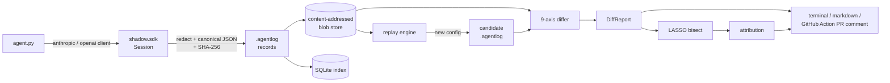
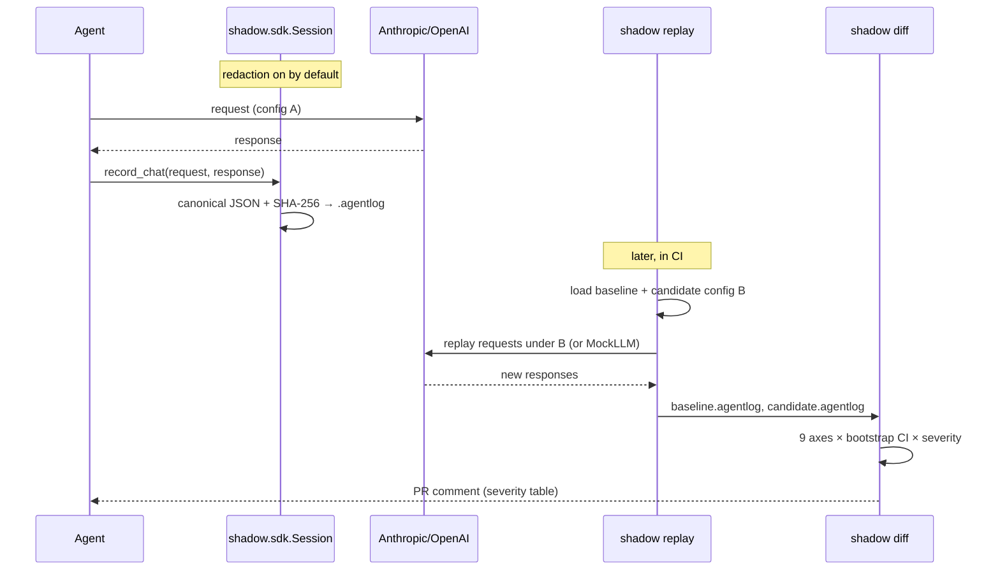
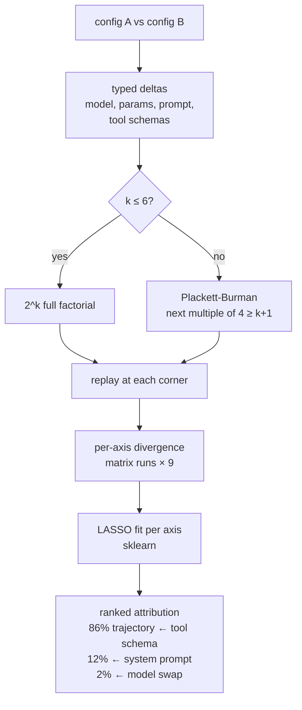

# Shadow

[](https://github.com/manav8498/Shadow/actions/workflows/ci.yml)
[](#license)
[](SPEC.md)
[](CHANGELOG.md)

> **Git-native behavioral diff and shadow deployment for LLM agents.**
> Codecov for AI agents — replay production traces against a proposed
> config change, get a nine-axis behavioral diff in your PR, and
> automatically bisect which change caused which regression.

<!-- TODO(v0.2): replace with a real recorded demo GIF.
     Generate with: bash examples/demo/demo.sh | asciinema rec | agg out.gif -->


*(Demo GIF placeholder — the `just demo` command reproduces the terminal
output shown below. See [`examples/demo/`](examples/demo/) for the exact
script.)*

## Why Shadow?

Every AI team hits this problem weekly: a model drops
(`claude-opus-4-6` → `4-7`), a prompt gets edited, or a tool schema
changes. Nobody knows what silently regressed in production until a user
complains.

Existing observability products are dashboards you log into *after*
something is broken. **Shadow lives in the PR** — it tells you, before
you merge, that the candidate config produces 4× the latency, 2× the
verbosity, and a 33% increase in safety refusals, all attributable to
your prompt edit and not the model bump.

### What makes it different

| | Langfuse | Braintrust | LangSmith | **Shadow** |
|---|---|---|---|---|
| Dashboard to visit | ✓ | ✓ | ✓ | PR comment |
| Self-hostable | ✓ | — | — | ✓ (local-only in v0.1) |
| Replay prod against new config | ✓ | ✓ | ✓ | ✓ |
| Behavioral diff across N axes | — | partial (custom scorers) | partial | **9 axes, bootstrapped CIs** |
| Causal bisection | — | — | — | **LASSO + Plackett-Burman** |
| Content-addressed trace format (OSS spec) | — | — | — | **SPEC.md (Apache-2.0)** |
| CI-native | partial | partial | partial | **composite GitHub Action** |

Shadow is narrower in scope (no hosted UI, no cross-org trace
sharing) but sharper on the "does this PR regress things?" question
that owns you at 3 AM.

## Quickstart (60 seconds)

```bash
git clone https://github.com/manav8498/Shadow
cd shadow
just setup          # user-local rustup if needed, then uv venv, maturin develop
just demo           # runs examples/demo/demo.sh — MockLLM, no network
```

Expected: the 9-axis diff table prints in your terminal in ≈1 s.

<details>
<summary>Sample output (abbreviated)</summary>

```
Shadow diff — 3 response pair(s)
axis              baseline  candidate  delta        95% CI            severity
semantic             1.000      0.732  -0.268   [-0.31, -0.25]        moderate
trajectory           0.000      0.000  +0.000   [+0.00, +1.00]            none
safety               0.000      0.333  +0.333   [+0.00, +1.00]            none
verbosity           26.000     52.000 +26.000   [-17.00, +40.00]        severe
latency             98.000    412.000 +314.000  [+314.00, +419.00]      severe
cost                 0.000      0.000  +0.000   [+0.00, +0.00]            none
reasoning            0.000      0.000  +0.000   [+0.00, +0.00]            none
judge                0.000      0.000  +0.000   [+0.00, +0.00]            none
conformance          0.000      0.000  +0.000   [+0.00, +0.00]            none
worst severity: severe
```
</details>

Then point it at your own code:

```bash
cd path/to/your/agent/repo
shadow init
# instrument your agent with shadow.sdk.Session (see examples/demo/agent.py)
python my_agent.py   # produces .shadow/traces/*.agentlog
shadow replay candidate-config.yaml --baseline path/to/baseline.agentlog
shadow diff path/to/baseline.agentlog .shadow/replays/latest.agentlog
```

## How it works

### Architecture



Five stages — record (Python SDK), store (content-addressed FS +
SQLite), replay (pluggable backend), diff (nine axes, bootstrap CI,
severity classification), bisect (LASSO over a Plackett-Burman design).

### Record → Replay → Diff



### Bisection



## CLI

| Command | What it does |
|---|---|
| `shadow init` | Scaffold `.shadow/` with config, sharded trace dir, SQLite index |
| `shadow record -- <cmd>` | Run `<cmd>` with `SHADOW_SESSION_OUTPUT` set, subprocess captures |
| `shadow replay <cfg> --baseline <trace>` | Replay baseline requests against `<cfg>`; writes a candidate `.agentlog` |
| `shadow diff <baseline> <candidate>` | Nine-axis diff with bootstrap CIs; optional `--output-json` |
| `shadow bisect <cfg-a> <cfg-b> --traces <set> [--backend anthropic\|openai\|positional]` | Causal attribution. With `--backend` runs full LASSO-over-corners (real replay per corner); otherwise heuristic allocator. |
| `shadow report <report.json> --format {terminal,markdown,github-pr}` | Re-render a saved DiffReport |

See `CLAUDE.md` §Coding conventions for the exact error-message format
(every error ends with a `hint:` line).

## The `.agentlog` format

Open spec in [`SPEC.md`](SPEC.md) — Apache-2.0, dual-licensed separately
from the MIT-licensed implementation. Headlines:

- **JSON Lines**, one record per line, streaming-safe.
- **Content-addressed**: `id = sha256(canonical_json(payload))`
  (RFC 8785 JCS + Unicode NFC). Two identical requests dedupe to one
  blob (§6.1).
- **OpenTelemetry GenAI compatible** — every field maps onto the OTel
  semantic conventions (§7).
- **Redaction-by-default** at record boundaries, with a per-key
  allowlist (§9).
- **Known-vector conformance test** (§5.6): `{"hello":"world"}` →
  `sha256:93a23971…681588`.

## GitHub Action

Composite action under [`.github/actions/shadow-action/`](.github/actions/shadow-action/).
Post a nine-axis PR comment on every PR that touches your prompts or
configs:

```yaml
- uses: manav8498/Shadow/.github/actions/shadow-action@v0.1.0
  with:
    baseline: path/to/baseline.agentlog
    candidate: path/to/candidate.agentlog   # produced earlier in the workflow
    pricing: path/to/pricing.json           # optional
```

Sample PR comment in [`docs/sample-pr-comment.md`](docs/sample-pr-comment.md).

## Worked examples

Five scenarios, all runnable offline from committed fixtures:

| Directory | What it shows |
|---|---|
| [`examples/demo/`](examples/demo/) | `just demo` — the 1-second smoke test. |
| [`examples/customer-support/`](examples/customer-support/) | Acme refund bot; PR drops confirm-before-refund. |
| [`examples/er-triage/`](examples/er-triage/) | Clinical triage (5 patients); high-stakes. |
| [`examples/devops-agent/`](examples/devops-agent/) | Prod-DB agent (10 tools); tests tool-ORDER reversal. |
| [`examples/edge-cases/`](examples/edge-cases/) | 20-case adversarial probe — permanent regression guard. |

Each has its own `WALKTHROUGH.md` narrating what it demonstrates and,
honestly, what Shadow doesn't catch. See [`examples/README.md`](examples/README.md)
for the full tour.

## Limitations (v0.1)

Deliberate scope cuts — honesty up front beats discovering them after
you've adopted:

- **Local-only.** Traces live on disk + SQLite; no cloud, no remote
  sharing. Exporters for Langfuse / Braintrust / LangSmith map cleanly
  from the `.agentlog` format but aren't shipped in v0.1 (SPEC §11).
- **Semantic axis uses a hash surrogate in pure-Rust tests.**
  Production embeddings (`sentence-transformers/all-MiniLM-L6-v2`) live
  in the Python layer and require the `[embeddings]` extra.
- **Bisection has three modes.** With `--backend {anthropic,openai}`,
  Shadow runs the real **LASSO-over-corners** scorer: build a 2^k
  full-factorial design across the differing config categories
  (`model`, `prompt`, `params`, `tools`), replay the baseline through
  the live backend at each corner, compute the nine-axis divergence,
  and fit LASSO per axis. With `--candidate-traces <path>` (no
  backend), Shadow falls back to a heuristic kind-based allocator that
  maps each delta-category to axes it can plausibly affect. With
  neither, it returns zero weights and warns.
- **No auto-instrumentation** of `anthropic` / `openai` Python clients.
  Users instrument manually with `shadow.sdk.Session.record_chat()`.
- **Judge axis is a Protocol, no default implementation.** Users
  supply their own rubric. This is deliberate: defaulting to any
  particular rubric would be domain hardcoding.
- **CI: Ubuntu + macOS only.** Windows isn't tested in v0.1.
- **Redaction is record-boundary, not token-level** (SPEC §1.2).

## Contributing

- New contributor? Start with [`CONTRIBUTING.md`](CONTRIBUTING.md) —
  setup, inner loop, how a PR gets reviewed.
- Proposing a new diff axis or a domain-specific detector? Read
  [`CONTRIBUTING.md §The Judge axis and domain rules`](CONTRIBUTING.md#the-judge-axis-and-domain-rules)
  first; the answer is often "this belongs in a Judge, not the core."
- [`CLAUDE.md`](CLAUDE.md) is the architecture + conventions
  source-of-truth for maintainers and deeper contributors.
- [`ROADMAP.md`](ROADMAP.md) is where v0.2+ plans live; pick an item
  and open a PR or issue.

We follow the [Contributor Covenant v2.1](CODE_OF_CONDUCT.md).

## Security

Please do NOT file security issues publicly — see
[`SECURITY.md`](SECURITY.md) for the private reporting channel and what's
in scope.

## License

- Implementation code: **MIT** (see [`LICENSE`](LICENSE)).
- `SPEC.md` (the `.agentlog` format): **Apache-2.0** (see
  [`docs/SPEC-LICENSE.md`](docs/SPEC-LICENSE.md)).

Dual-licensing is deliberate: anyone can re-implement the `.agentlog`
format under any license, while the reference implementation stays
MIT.
