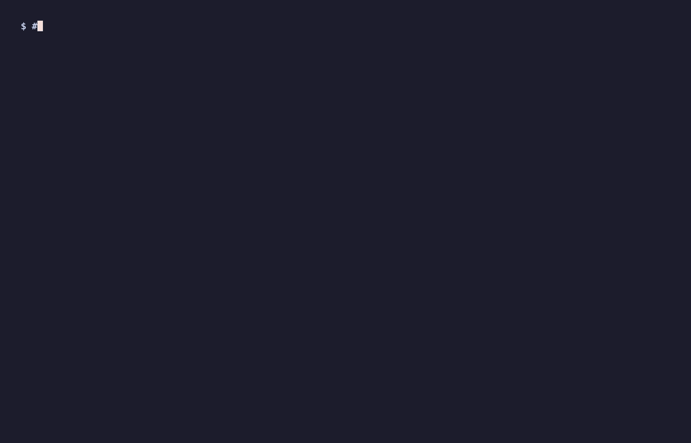

<p align="center">
  
</p>

# Shadow

[](https://github.com/manav8498/Shadow/actions/workflows/ci.yml)
[](#license)
[](SPEC.md)
<!-- x-release-please-start-version -->
[](CHANGELOG.md)
<!-- x-release-please-end -->
[](rust-toolchain.toml)
[](python/pyproject.toml)

**Find the exact change that broke your AI agent.**

A teammate edits a system prompt or swaps a model. Code review looks fine. Unit tests pass. You merge. A week later a customer reports the refund agent stopped asking for confirmation. Nobody saw it coming because the code looked harmless.

Shadow catches that bug class on the PR. `shadow diagnose-pr` answers, in one PR comment:

1. **Did agent behavior change?** Yes / no, with severity.
2. **How many traces are affected?** Out of N representative production-like cases.
3. **Which exact candidate change caused it?** Prompt edit, model swap, tool-schema rename, config delta — named with a `file:line` citation.
4. **With what confidence?** ATE + 95% bootstrap CI + E-value when run with `--backend live`; deterministic delta-attribution otherwise.
5. **What fix should `verify-fix` confirm before merge?**

```bash
shadow diagnose-pr \
  --traces           prod-traces/ \
  --candidate-traces candidate-traces/ \
  --baseline-config  baseline.yaml \
  --candidate-config candidate.yaml \
  --policy           shadow-policy.yaml \
  --pr-comment       comment.md
```

→ Try the [60-second runnable demo](examples/refund-causal-diagnosis/), or read [`docs/features/causal-pr-diagnosis.md`](docs/features/causal-pr-diagnosis.md) for the full flow.

<p align="center">
  
</p>

<p align="center">
  <sub>
    <a href="docs/sample-pr-comment.md"><b>See a real Shadow PR comment ↗</b></a>
    &nbsp;·&nbsp;
    <a href="https://github.com/manav8498/Shadow/blob/main/.github/assets/launch.mp4">launch video (84 s)</a>
    &nbsp;·&nbsp;
    <a href="https://github.com/manav8498/Shadow/releases/download/demo-assets/launch.mp4">MP4</a>
    /
    <a href="https://github.com/manav8498/Shadow/releases/download/demo-assets/launch.webm">WebM</a>
  </sub>
</p>

## Why ordinary CI can't catch this

Unit tests assert what code returns, not how an agent *behaves*. The refund agent that drops "always confirm" is still parseable Python. The model swap from GPT-4o to a cheaper one still returns valid responses. The tool schema renamed `order_id` → `id` still typechecks both sides. Every guardrail your normal CI gives you is irrelevant — the regression is in the agent's decisions, not the code.

**Shadow turns "how should this agent behave?" into a YAML contract** — your CI tests every PR against it; your runtime enforces it against every tool call. Same rule, both places. When the contract breaks, Shadow names the line in the PR that broke it.

## What Shadow does, in one screen

Given a baseline `.agentlog` and a candidate change, Shadow answers three questions on the PR:

1. **What behavior changed?** A nine-axis diff scores response meaning, tool calls, refusals, length, latency, cost, output format, and more — with a plain-English summary on top.
2. **Why did it change?** If the PR touched multiple things at once, regression attribution names the specific change that most likely explains each regression.
3. **Is it safe to merge?** A YAML policy declares rules the agent must follow (tool ordering, output shape, forbidden outputs). The same policy enforces at runtime.

The report lands in the PR comment. No dashboard, no separate login, no trace upload. Traces stay on your disk.

## Install

**Step 1.** Check you have Python 3.11 or newer:

```bash
python3 --version    # 3.11.x or higher
```

**Step 2.** Install Shadow from PyPI:

```bash
pip install shadow-diff
```

That's it. `shadow --help` should now work, and `shadow quickstart` runs the demo. No clone, no Rust toolchain, no separate setup step — pre-built wheels ship for Linux x86_64, macOS arm64 (Apple Silicon), and Windows x86_64.

**On other platforms** (Intel Mac, ARM Linux, older glibc, Alpine, FreeBSD), pip falls back to the source distribution and builds the Rust core locally. Install Rust first:

```bash
curl --proto '=https' --tlsv1.2 -sSf https://sh.rustup.rs | sh
pip install shadow-diff
```

### Optional extras

Shadow's core install is lean. Most users want one of:

```bash
pip install 'shadow-diff[anthropic]'   # if your agent uses Claude
pip install 'shadow-diff[openai]'      # if your agent uses GPT
pip install 'shadow-diff[embeddings]'  # better paraphrase-robust diff
```

<details>
<summary>All optional extras (framework adapters, dashboard, signing, OTel, …)</summary>

| Extra | Pulls in | Use case |
|---|---|---|
| `shadow-diff[anthropic]` | `anthropic` | Live Anthropic client wrapper for `shadow record` |
| `shadow-diff[openai]` | `openai` | Live OpenAI client wrapper for `shadow record` |
| `shadow-diff[embeddings]` | `sentence-transformers` | Paraphrase-robust semantic-similarity axis. The default lexical TF-IDF path stays fast and dependency-free; the `Embedder` trait accepts any backend (this extra, ONNX runtime, HF Inference API, OpenAI embeddings, …). |
| `shadow-diff[otel]` | `opentelemetry-sdk` | Export traces to any OTel-compatible backend |
| `shadow-diff[serve]` | `fastapi`, `uvicorn`, `websockets` | `shadow serve` (live `.shadow/` dashboard) and `shadow dashboard --report report.json` (single-report viewer) |
| `shadow-diff[mcp]` | `mcp` | `shadow mcp-serve` Model Context Protocol server |
| `shadow-diff[multimodal]` | `Pillow`, `imagehash` | Image / multimodal diff |
| `shadow-diff[sign]` | `sigstore` | Sigstore keyless signing for ABOM certificates |
| `shadow-diff[langgraph]` | `langgraph` | LangGraph agent adapter |
| `shadow-diff[crewai]` | `crewai` | CrewAI agent adapter |
| `shadow-diff[ag2]` | `ag2` | AG2 / Autogen agent adapter |
| `shadow-diff[all]` | everything above | One-shot install for trying the full feature surface |
| `shadow-diff[dev]` | test/lint/type-check tooling | Contributing to Shadow itself |

Combine extras with comma-separated form:

```bash
pip install 'shadow-diff[anthropic,openai,embeddings,otel]'
```
</details>

### Telemetry: off by default, opt-in only

Shadow ships an opt-in usage-telemetry hook. When enabled, each
event includes: CLI command / event name, SDK version, Python
version, OS, CPU architecture, and an anonymous install ID
(random UUID4 generated once, stored at `~/.shadow/install_id`,
never tied to identity). **No traces, no prompts, no user data.**
Telemetry is **off by default** — the first-run prompt asks before
enabling. CI environments are detected and skipped automatically.
Hard-disable with `SHADOW_TELEMETRY=off` in your shell. Source:
[`python/src/shadow/_telemetry.py`](python/src/shadow/_telemetry.py).

Shadow never uploads `.agentlog` content, prompt text, response
text, or tool arguments. The only fields collected when telemetry
is enabled are listed in the module docstring.

## Try it in sixty seconds

```bash
git clone https://github.com/manav8498/Shadow.git
cd Shadow/examples/refund-causal-diagnosis
./demo.sh
```

That runs `shadow diagnose-pr` end-to-end on a refund-agent scenario where the candidate config drops a "always confirm before refunding" instruction. Shadow names the prompt change as the dominant cause and tells you the fix:

```
## Shadow verdict: STOP

This PR violates a critical policy and must not merge as-is.
This PR changes agent behavior on **3** / **3** production-like traces.

### Dominant cause
`prompt.system` appears to be the main cause.
- Axis: `trajectory`
- ATE: `+0.60`
- 95% CI: `[0.60, 0.60]`
- E-value: `6.7`

### Why it matters
3 traces violate the `confirm-before-refund` policy rule.

### Suggested fix
Review the prompt change at `prompts/candidate.md` — restore the
instruction or constraint it removed.
```

For the underlying nine-axis behavior diff (without the causal layer), `shadow demo` runs the same fixtures through `shadow diff` and prints a severity table — useful when you want raw signal numbers:

```bash
shadow demo
```

That output looks like this (abbreviated):

```
signal             baseline  candidate    change     severity
─────────────────────────────────────────────────────────────
response meaning      1.000      0.435    -0.565     severe
tool calls            0.000      0.000    +0.000     none
refusals              0.000      0.333    +0.333     severe
response length      26.000     52.000   +26.000     minor
response time        98.000    412.000  +314.000     severe
output format         1.000      0.000    -1.000     severe

top divergences:
  #1  turn 0 — tool set changed: removed `search_files(query)`,
                                  added `search_files(limit,query)`
  #2  turn 2 — stop_reason changed: `end_turn` → `content_filter`

recommendations:
  error   Refusal rate is up severely. Check for stricter system instructions.
  error   Review tool-schema change at turn 0: call shape diverged.
  warning Review response text at turn 1: semantic content shifted.
```

Three things to read top-to-bottom: the severity column tells you which signals moved, the top-divergences list names the specific changes, and the recommendations tell you what to check first. **A reviewer doesn't need to know any Shadow vocabulary** — the recommendation lines speak plain English.

Use `shadow quickstart` when you want a writable copy of the demo files (agent.py, configs, fixtures) to edit and re-run:

```bash
shadow quickstart
shadow diff shadow-quickstart/fixtures/baseline.agentlog \
            shadow-quickstart/fixtures/candidate.agentlog
```

## Daily workflow — Shadow as `pytest` for agent behavior

The four commands you'll actually run all day:

```bash
shadow inspect trace.agentlog                         # debug a single trace
shadow scan baseline_traces/ candidate_traces/        # block secret leaks
shadow baseline create baseline_traces/               # pin the gold standard
shadow gate-pr ...                                    # gate every PR
```

**`shadow inspect`** opens a `.agentlog` file in your terminal — turn, role, tokens, latency, cost, redactions, first divergence. What `pytest -v` is to test runs, this is to recorded traces. Pass two paths to compare side-by-side; the first divergent turn is highlighted in red.

**`shadow scan`** walks your `.agentlog` files looking for OpenAI / Anthropic / GitHub / AWS keys, JWTs, PEM private keys, emails, phone numbers, and Luhn-valid credit cards. Exit code is non-zero on any hit, so it composes into CI before `shadow gate-pr`. Add company-specific patterns via `--patterns ci/extra-secrets.txt`.

**`shadow baseline`** is a frozen-trace workflow modeled on Insta and Jest snapshots:

```bash
shadow baseline create baseline_traces/    # pin the hash into shadow.yaml
shadow baseline verify                     # exit non-zero on drift
shadow baseline update --force             # re-pin after a deliberate regen
shadow baseline approve candidate_traces/ --force  # promote candidate to baseline
```

The hash lives in `shadow.yaml` so PRs that change the baseline show up in `git diff` as a single line. Reviewers see "the baseline hash changed in this PR" — a deliberate signal that the agent's expected behavior was reset.

**`shadow gate-pr`** prints a 1-screen failure summary that reads like a pytest assertion failure:

```
✗ Shadow gate-pr: STOP (exit 2) — 3/3 traces affected
  Cause: prompts/refund.md:17 appears to be the main cause.
  - removed: 4. Always confirm the refund amount before issuing the refund.
  trajectory: ATE=+0.60  95% CI=[0.50, 0.70]  E=6.7
  Policy: 3 new violation(s) of confirm-before-refund
  Fix: Restore the prompt instruction at prompts/refund.md:17
  Verify: shadow verify-fix --report .shadow/diagnose-pr/report.json
```

Pass `-v` / `--verbose` to also dump the full JSON report. The PR-comment markdown is always written via `--pr-comment` regardless of verbosity. Exit code: `0` ship, `1` hold/probe, `2` stop, `3` internal error.

## Get a Shadow comment on every PR (≈ 10 minutes)

The end-to-end setup, from a fresh repo to seeing your first Shadow comment land on a real PR. Skip any step you've already done.

**1. Install Shadow** (one line):

```bash
pip install shadow-diff
```

**2. Record baseline + candidate traces.** Wrap the place where your agent runs in a `Session` block. Shadow auto-instruments OpenAI / Anthropic SDK calls and writes content-addressed `.agentlog` files:

```python
# scripts/record_traces.py
from shadow.sdk import Session

with Session(output_path="baseline.agentlog"):
    run_my_agent()   # whatever your existing entry-point is
```

Run it once on baseline (`main`), once on the candidate (your PR branch), and commit both `.agentlog` directories. Traces stay on your disk and inside your repo — nothing is uploaded.

**3. Drop in the diagnose-pr GitHub Action.** Scaffold a workflow that runs `shadow diagnose-pr` on every PR — names the exact change that broke the agent, posts the verdict + suggested fix as a comment, and gates the merge with verdict-mapped exit codes (`ship`=0, `hold`/`probe`=1, `stop`=2):

```bash
shadow init --github-action
git add .github/workflows/shadow-diagnose-pr.yml && git commit -m "ci: shadow diagnose-pr"
```

The generated workflow uses the [`shadow-diagnose-pr`](.github/actions/shadow-diagnose-pr/action.yml) composite action with the `recorded` backend by default (offline, no API spend). Switch to `--backend live` (and add an `OPENAI_API_KEY` secret) when you want real intervention-based ATE + bootstrap CI + E-value on the dominant cause.

For a hand-rolled workflow, the action is a one-liner:

```yaml
- uses: manav8498/Shadow/.github/actions/shadow-diagnose-pr@main
  with:
    baseline-traces: fixtures/baseline_traces
    candidate-traces: fixtures/candidate_traces
    baseline-config:  configs/baseline.yaml
    candidate-config: configs/candidate.yaml
    policy:           configs/shadow-policy.yaml
    backend:          recorded
```

Forked PRs run with a read-only `GITHUB_TOKEN`, so the action falls back to the workflow summary instead of attempting to post a comment that would fail. The marker-dedup means a re-run on the same PR edits the existing comment rather than stacking new ones.

**4. Open a PR.** The Shadow comment lands automatically. It leads with the verdict, names the dominant cause (or lists likely candidates when attribution can't crown one), explains the policy violation in plain English, and ends with the `shadow verify-fix` command to confirm a fix before merge. See [`docs/sample-pr-comment.md`](docs/sample-pr-comment.md) for an example, or [`examples/refund-causal-diagnosis/`](examples/refund-causal-diagnosis/) for a runnable scenario you can cargo-cult into your own repo.

That's it. The earlier path of `shadow init --github-action --legacy-diff` (raw nine-axis `shadow diff` without causal attribution) still ships for repos that prefer the older flow; everything below is optional depth.

## Writing behavior rules

The diff tells you what changed. A policy tells you what is not allowed to change. Write one YAML file that declares the agent's behavioral contract:

```yaml
# shadow-policy.yaml
rules:
  - id: confirm-before-refund
    kind: must_call_before
    params: { first: confirm_refund_amount, then: issue_refund }
    severity: error

  - id: never-leak-ssn
    kind: forbidden_text
    params: { text: "SSN:" }
    severity: error

  - id: finish-cleanly
    kind: required_stop_reason
    params: { allowed: [end_turn, tool_use] }
    severity: error

  - id: cost-ceiling
    kind: max_total_tokens
    params: { limit: 100000 }
```

Run:

```bash
shadow diff baseline.agentlog candidate.agentlog --policy shadow-policy.yaml
```

The candidate trace is checked against every rule. Violations that are new in the candidate are flagged as regressions. Violations that existed in the baseline and are now cleared are flagged as fixes. Twelve rule kinds ship today: `must_call_before`, `must_call_once`, `no_call`, `max_turns`, `required_stop_reason`, `max_total_tokens`, `must_include_text`, `forbidden_text`, `must_match_json_schema`, `must_remain_consistent`, `must_followup`, `must_be_grounded` (cheap lexical grounding gate, not NLI-backed faithfulness — see [docs/features/policy.md](docs/features/policy.md) for what it catches and what it doesn't).

`must_match_json_schema` is the structured-output assertion: every chat response is parsed as JSON and validated against a JSON Schema. Mismatches name the offending dotted path so reviewers see exactly which field broke.

```yaml
rules:
  - id: structured-output
    kind: must_match_json_schema
    params:
      schema_path: schemas/refund_decision.schema.json
    severity: error
```

Supply either an inline `schema:` dict or a `schema_path:` to a JSON Schema file. NaN / Infinity literals are rejected because they aren't valid JSON per RFC 8259 even though Python's parser accepts them.

Each rule can carry a `when:` clause that gates it on field-path conditions, so a rule fires only on the matching subset of pairs:

```yaml
rules:
  - id: confirm-large-refunds
    kind: forbidden_text
    params: { text: "refund issued" }
    when:
      - { path: "request.params.amount", op: ">", value: 500 }
      - { path: "request.model", op: "==", value: "gpt-4.1" }
```

Supported operators: `==`, `!=`, `>`, `>=`, `<`, `<=`, `in`, `not_in`, `contains`, `not_contains`. Multiple conditions AND together. Missing paths quietly don't match (rule is skipped on that pair) instead of crashing the whole check.

This is the part that makes Shadow feel like CI for agents instead of monitoring. See [docs/features/policy.md](docs/features/policy.md) for the full rule reference, conditional gating semantics, and severity → `--fail-on` mapping.

## Block bad behavior at runtime

The same policy file can run inside the SDK to block or replace a violating model response at record time, not just after the fact:

```python
from shadow.policy_runtime import EnforcedSession, PolicyEnforcer

enforcer = PolicyEnforcer.from_policy_file("shadow-policy.yaml")
with EnforcedSession(enforcer=enforcer, output_path="run.agentlog") as s:
    s.record_chat(request=..., response=...)
```

When a recorded turn introduces a new violation, the session swaps the response for a refusal payload by default (`stop_reason: "policy_blocked"`) so downstream code keeps running. Set `on_violation="raise"` for hard failure, `"warn"` for log-only. The enforcer is incremental — whole-trace rules fire once when crossed, not once per recorded record.

For dangerous tools (`issue_refund`, `send_email`, `execute_sql`, `delete_user`), wrap the tool registry to enforce BEFORE the function runs:

```python
guarded = s.wrap_tools({
    "issue_refund": issue_refund,
    "delete_user": delete_user,
})
result = guarded["delete_user"](user_id="u-42")
# → blocked by no_call rule, real delete_user never called
```

The wrapper probes the enforcer with a synthesised candidate `tool_call` record. Tool-sequence rules (`no_call`, `must_call_before`, `must_call_once`) all work pre-dispatch. Response-text rules stay on `record_chat`. See [docs/features/runtime-enforcement.md](docs/features/runtime-enforcement.md) for the full surface, including standalone `wrap_tools(..., records_provider=...)` for framework-adapter integrations.

## Beyond the basics

Everything above is the load-bearing pitch — install, the 10-minute walkthrough, writing a YAML rule, and runtime enforcement. **That's the whole product for most users.** What's below are the deeper features each backed by its own doc page; skip whichever isn't relevant to you.

- **[Recording real agent traces](docs/quickstart/record.md)** — `shadow record -- python your_agent.py` (or `node` / `bun`) auto-instruments OpenAI, Anthropic, LiteLLM, LangChain `ChatOpenAI`, and Vercel AI SDK calls. Redacts secrets by default, writes content-addressed `.agentlog` files. No code changes.
- **[Framework adapters](docs/features/adapters.md)** — first-class hooks for LangGraph, CrewAI, and AG2. The chat client patches still cover everything; the adapter just pulls in the framework's structural metadata (graph nodes, crew kickoffs, agent boundaries).
- **[Sandboxed deterministic replay](docs/features/sandboxed-replay.md)** — replay a candidate trace under a different config without touching production. Real tool functions run with network/subprocess/FS-write blocked; the output is an ordinary `.agentlog`.
- **OpenTelemetry import** — `shadow import --format otel <export>` converts existing OTel GenAI semantic-convention spans to `.agentlog`. See [`docs/reference/cli.md`](docs/reference/cli.md) for the full flag set.
- **[Agent Behavior Certificates](docs/features/certificate.md)** — `shadow certify` produces a content-addressed JSON release artifact (model + system prompt hash + tool-schema hash + policy hash + optional regression-suite rollup), signed via sigstore keyless. `shadow verify-cert` validates content-addressing and signature against a specific signer identity.
- **[MCP server](docs/features/mcp-server.md)** — `shadow mcp-serve` exposes Shadow's diff / certify / verify / policy-check capabilities to any MCP-aware client over stdio. Lets agentic CLIs (Claude Desktop, Cline, etc.) treat Shadow as a tool.
- **Production trace mining** — `shadow mine <traces>` clusters turn-pairs by tool sequence + stop reason and selects representative cases. Compresses a production trace dump into a regression suite. See [`docs/reference/cli.md`](docs/reference/cli.md#shadow-mine).
- **[Why regressions happened, not just what](docs/features/bisect.md)** — `shadow bisect` (LASSO-based, stable CLI) attributes each regressing axis to the specific config delta most likely responsible. The opt-in [`shadow.causal`](docs/theory/causal.md) module adds intervention-based ATE with optional bootstrap CIs and back-door adjustment for confounders.
- **[The nine behavioral dimensions](docs/features/nine-axis.md)** — `response meaning`, `tool calls`, `refusals`, `length`, `response time`, `cost`, `reasoning depth`, `LLM-judge score`, `output format`. Each measured independently with bootstrap 95% confidence intervals; severity bands tested empirically.
- **[Statistical, formal, and causal primitives](docs/theory/)** — Hotelling T² with shrinkage, SPRT and mixture-SPRT, conformal coverage with adaptive drift, LTLf model checking with bottom-up DP. These compose with the nine-axis diff to make certificates evidence-backed instead of just claim-backed. Each has its own theory page; the validation suite empirically verifies Type-I rate, power, and coverage.
- **[Worked examples](examples/)** — 9 runnable scenarios: refund bot regression after a prompt edit, devops agent with a tool-ordering bug, ER triage with safety rules, harmful-content domain judge, public-incident reproductions (Air Canada / Avianca / NEDA / McDonald's / Replit), production-trace mining, statistical safety audit. Every example runs offline from committed fixtures with no API key required.

## Where Shadow fits

Shadow is a CI/repo-native tool. **It does not replace your LLM observability platform — it complements one.** Most teams will end up using one of each.

| Use [Langfuse](https://langfuse.com) / [Helicone](https://helicone.ai) / [Braintrust](https://braintrust.dev) for | Use Shadow for |
|---|---|
| Production trace logging + dashboards | Repo-native PR comments and merge-gating |
| Cross-team trace search and visualization | Behavior contracts in YAML, enforced at PR-time **and** runtime |
| Long-term observability storage | Content-addressed release certificates and supply-chain signing |
| Custom evals you build in their UI | Pre-built nine-axis diff + statistical primitives |

If you want a hosted dashboard for your traces, use whichever platform you already have. If you want behavior changes blocked in your PR before they merge — and the same rule enforced at runtime so a runtime override can't ship something CI rejected — that's what Shadow ships as a single command.

```bash
shadow record -o baseline.agentlog -- python your_agent.py

# change a prompt, swap a model, re-record
shadow record -o candidate.agentlog -- python your_agent.py

shadow diff baseline.agentlog candidate.agentlog
```

If you want more control (custom tags, a non-default redactor, nested sessions), use the `Session` context manager:

```python
from shadow.sdk import Session

with Session(output_path="trace.agentlog", tags={"env": "prod"}):
    client.messages.create(model="claude-sonnet-4-6", messages=[...])
```

Secrets (API keys, emails, credit cards) are redacted by default.

The TypeScript SDK covers the recording side of this same workflow plus a CI-gating decision surface. Numerical analyses that depend on the Rust core (replay, diff, bisect, certify, MCP server) stay on the Python/CLI side:

| Feature | Python | TypeScript |
|---|:---:|:---:|
| `.agentlog` write / parse / canonicalisation | ✅ | ✅ |
| `Session` context manager | ✅ | ✅ |
| Redaction | ✅ | ✅ |
| Distributed-trace (W3C) propagation | ✅ | ✅ |
| OpenAI Chat Completions + Anthropic Messages auto-instrument | ✅ | ✅ |
| OpenAI Responses API auto-instrument | ✅ | ✅ |
| Streaming aggregation in auto-instrument | ✅ | ✅ |
| LTLf evaluator (bottom-up DP, all 10 operators) | ✅ | ✅ |
| Policy gating (`no_call`, `must_call_before`, `must_call_once`, `forbidden_text`, `must_include_text`) | ✅ | ✅ |
| `gate(records, { rules, ltlFormulas })` CI decision | ✅ (via `shadow.policy_runtime`) | ✅ |
| Runtime policy enforcement (`EnforcedSession`, pre-dispatch tool guards) | ✅ | ❌ |
| `shadow certify` / `--sign` / `verify-cert` | ✅ (CLI) | ❌ |
| `shadow diff` / `bisect` / `replay` / `mine` | ✅ (CLI) | ❌ |
| MCP server (`shadow mcp-serve`) | ✅ (CLI) | ❌ |

The Python SDK and TypeScript SDK ship lockstep at the same version. The `.agentlog` format itself is the contract — TS-recorded traces feed into Python's `shadow diff`, `shadow certify`, and the MCP server without translation. The TS gate decisions are byte-identical to the Python equivalents on the same fixtures (cross-validated by `python/tests/test_typescript_parity.py`). For deeper analyses (multi-axis diff, bisect, certify), run those from the Python CLI against the TS-recorded trace.

If your agent is built on LangGraph, CrewAI, or AG2, prefer the [matching framework adapter](docs/features/adapters.md) over auto-instrumentation. Auto-instrument patches `.create` on the underlying provider SDK, which is a moving target across SDK majors. The framework adapters hook each framework's documented extension surface, which is the more stable contract.

## CLI reference

| Command | Does |
|---|---|
| `shadow diagnose-pr` | **The wedge command.** Names the exact change that broke the agent — verdict + dominant cause + bootstrap CI + E-value + Markdown PR comment. `--backend recorded\|mock\|live`; `--max-cost USD` caps live spend. |
| `shadow verify-fix` | Closes the diagnose -> fix -> verify loop. Reads a diagnose-pr `report.json`, re-diffs only the affected traces against a candidate-with-patch, asserts regression reversed without collateral damage. |
| `shadow gate-pr` | CI-friendly wrapper around `diagnose-pr` with verdict-mapped exit codes (0 ship / 1 hold\|probe / 2 stop / 3 internal error). |
| `shadow dashboard --report report.json` | Serve a `diagnose-pr` report as a browsable HTML page. Local-by-default (`127.0.0.1:8080`); `--open` launches the browser. Requires the `[serve]` extra. |
| `shadow serve --root .shadow` | Start the live tail dashboard over a `.shadow/` directory — diffs land as new traces arrive. Local-by-default (`127.0.0.1:8765`). Requires the `[serve]` extra. |
| `shadow inspect <trace.agentlog> [<candidate>]` | One-screen terminal view of a trace — turn / role / tokens / latency / cost / redactions / first divergence. The daily-debug surface; what `pytest -v` is to test runs, this is to recorded agent traces. |
| `shadow scan <paths>` | Scan committed `.agentlog` files for credentials / PII / custom patterns. Exits non-zero on any hit. `--patterns FILE` for company-specific rules; `--redact-snippets` for CI logs; `--json` for machine-readable output. |
| `shadow baseline create / update / approve / verify` | Frozen-baseline workflow modeled on Insta + Jest snapshots. `create` pins a content hash to `shadow.yaml`; `update --force` re-pins after a deliberate regeneration; `approve --force` promotes a candidate; `verify` exits non-zero on drift. |
| `shadow demo` | Run a nine-axis diff against bundled fixtures. One command, no API key, no files written. |
| `shadow quickstart` | Drop a writable working demo scenario (agent.py, configs, fixtures) to edit and re-run. No API key needed. |
| `shadow init` | Scaffold `shadow.yaml` + `.shadow/` and detect the project type (Python / Node / Rust). `--github-action` also drops a diagnose-pr CI workflow with `--changed-files` + `--baseline-ref` wired in. |
| `shadow record -- <cmd>` | Run `<cmd>`, auto-capture its LLM calls. Zero code changes. |
| `shadow replay <cfg> --baseline <trace>` | Replay baseline through a new config. `--partial --branch-at N` locks a prefix, replays only the suffix. |
| `shadow diff <baseline> <candidate>` | Nine-axis behavior diff. `--policy <f>` to enforce rules. `--fail-on {minor,moderate,severe}` to gate the merge. `--token-diff` for per-turn token distribution. `--suggest-fixes` for LLM-assisted fix proposals. |
| `shadow call <baseline> <candidate>` | One-line ship-readiness call: `ship` / `hold` / `probe` / `stop`, with the dominant driver, worst axes (with bootstrap CIs), and suggested next commands. `--strict` makes hold/probe block; `--log` records to the ledger. |
| `shadow autopr <baseline> <candidate>` | Synthesise a Shadow policy from a regression. Pure deterministic — emits rules in the existing 12-kind language; `--verify` (default on) confirms each rule fires on the candidate and stays silent on the baseline. |
| `shadow bisect <cfg-a> <cfg-b> --traces <set>` | Attribute each axis regression to specific config deltas. |
| `shadow ledger` | Compact panel of recent artifacts: pass rate with 95% Wilson CI, most-concerning entry, suggested next commands. Reads `.shadow/ledger/`. Opt-in via `--log` on call/diff or via `shadow log`. |
| `shadow trail <trace-id>` | Walk back through the (anchor → candidate) edges from a trace id. Vertical chain showing each step's tier and driver, plus inline commands to re-verify or pin. |
| `shadow brief` | Tight summary in three formats: `terminal` (default), `markdown` (PR comments), `slack` (Block Kit). `--slack-webhook URL` posts directly via stdlib. |
| `shadow listen <dir> --anchor <path>` | Polling-based file-save trigger. Streams a one-line call as each new `.agentlog` candidate lands in the watched directory. |
| `shadow holdout add/remove/list/reset` | Manage held-out trace ids (acknowledged-but-not-blocking) with owner tags, reasons, and TTL-based staleness tracking. |
| `shadow log <report.json>` | Append a diff or call report to the ledger. Default `shadow diff` writes nothing; this is the explicit way to land an entry from a CI artifact. |
| `shadow schema-watch <cfg-a> <cfg-b>` | Classify tool-schema changes before replaying. |
| `shadow import <src> --format <fmt>` | Import foreign traces (langfuse, braintrust, langsmith, openai-evals, otel, mcp, a2a, vercel-ai, pydantic-ai). |
| `shadow mine <traces...>` | Cluster production traces and pick representative cases as a regression suite. |
| `shadow mcp-serve` | Run Shadow as a Model Context Protocol server so agentic CLIs can invoke it as a tool. |
| `shadow report <report.json>` | Re-render a diff as terminal, markdown, or PR-comment. |
| `shadow certify <trace>` | Generate an Agent Behavior Certificate (ABOM) for a release. `--baseline` folds in a regression-suite rollup; `--policy` records its hash. `--sign` adds a sigstore keyless signature (requires `[sign]` extra). |
| `shadow verify-cert <cert>` | Verify a certificate's content-addressed `cert_id` matches the body. Exits 1 on tamper. `--verify-signature --cert-identity <id>` also verifies the sigstore signature against the canonical body and a specific signer identity. |

## Project layout

```
Shadow/
├── crates/shadow-core/         Rust core: parser, differ, replay, bisect
├── python/                     Python SDK + CLI (maturin-built, ships as shadow-diff on PyPI)
│   ├── src/shadow/
│   └── tests/
├── typescript/                 TypeScript SDK
├── docs/                       mkdocs site (published at manav8498.github.io/Shadow)
├── examples/                   Runnable scenarios (demo, customer-support, devops-agent, er-triage, etc.)
├── benchmarks/                 Scale and correctness benchmarks
├── scripts/                    One-off build and release helpers
├── .github/
│   ├── actions/shadow-action/  Reusable composite action for PR comments
│   ├── workflows/              ci.yml, docs.yml, release.yml
│   └── ISSUE_TEMPLATE/
├── SPEC.md                     The .agentlog format specification (Apache-2.0)
├── CHANGELOG.md                Release notes
├── SECURITY.md                 Security policy and vulnerability reporting
├── CONTRIBUTING.md             How to contribute
├── RELEASE.md                  Maintainer guide: cutting a release, troubleshooting publish failures
├── GOVERNANCE.md               Project governance
├── Cargo.toml                  Rust workspace manifest
├── justfile                    Common dev tasks (just setup, just test, just demo)
├── mkdocs.yml                  Docs site config
└── pricing.json                Per-model token pricing for cost attribution
```

## License

- **Code and spec**: [Apache License 2.0](LICENSE).
- **Name "Shadow" and logo**: see [TRADEMARK.md](TRADEMARK.md).
- **Contributions**: every commit must carry a Developer Certificate of Origin sign-off (`git commit -s`). See [CONTRIBUTING.md](CONTRIBUTING.md#developer-certificate-of-origin-dco).

## Community

- [GitHub Discussions](https://github.com/manav8498/Shadow/discussions) for questions and help
- [GitHub Issues](https://github.com/manav8498/Shadow/issues) for bugs and feature requests
- [SECURITY.md](SECURITY.md) to report vulnerabilities privately
- [CONTRIBUTING.md](CONTRIBUTING.md) to contribute
- [Contributor Covenant v2.1](CODE_OF_CONDUCT.md)

## Citing

If you use Shadow in academic work, see [`CITATION.cff`](CITATION.cff) or click "Cite this repository" on the GitHub page.
