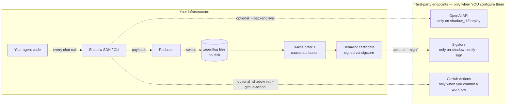

# Production readiness — security review brief

A 30-minute read for security reviewers, CISOs, and procurement. If
you're sitting in a one-pass meeting deciding whether to approve
Shadow for production use, this is the document.

The fast path: **Shadow runs entirely on your machine. No telemetry
is enabled by default. No agent traces leave your infrastructure
unless you explicitly export them.** Everything below is the
evidence supporting that one paragraph.

## Data flow at a glance



Solid lines stay on your machine. Dashed lines are external network
calls — every one is opt-in via a flag or an explicit config knob.

## What stays on disk

| Artifact | Where | Format | Sensitive? |
|---|---|---|---|
| `.agentlog` files | `.shadow/traces/` (or wherever you point) | JSONL, content-addressed sha256 | Pre-redacted by `Redactor`; see below |
| `shadow.yaml` | repo root | YAML | Project config — baseline pin, paths, `--policy` defaults |
| `report.json` | `.shadow/diagnose-pr/report.json` | JSON | Diff summary; same content as the PR-comment markdown |
| `*.cert.json` | wherever `--out` points | JSON | Behavior certificate; see "Signing chain" |
| `index.sqlite` | `.shadow/index.sqlite` | SQLite | Local trace index; never transmitted |

**Nothing is uploaded.** No telemetry endpoint, no metrics collector,
no auto-update channel. The only place network traffic can originate
from Shadow is when *you* explicitly opt into one of the dashed lines
above.

## Redaction — what the SDK sweeps before write

Every record written through `shadow.sdk.Session` runs through a
`Redactor` first. The redactor walks the payload (dict / list /
str), finds matches, and substitutes `[REDACTED:<pattern_name>]` —
the sha256 content-id is computed *after* redaction so the on-disk
hash reflects the redacted bytes only.

Default pattern set (`shadow.redact.DEFAULT_PATTERNS`):

| Pattern | What it catches |
|---|---|
| `private_key` | PEM-armoured RSA / EC / ED25519 / OpenSSH / encrypted / PGP private keys |
| `jwt` | Three-segment base64url JWTs (header.payload.signature, ≥10/10/20 chars) |
| `anthropic_api_key` | `sk-ant-…` (matched first so it doesn't fall to the broader OpenAI pattern) |
| `openai_api_key` | `sk-…`, `sk-proj-…`, `sk-svcacct-…`, `sk-admin-…` (any ≥20 chars) |
| `aws_access_key_id` | `AKIA` / `ASIA` / `AIDA` / `AROA` + 16 uppercase alnum |
| `github_token` | `ghp` / `gho` / `ghu` / `ghs` / `ghr` + 36-251 alnum |
| `email` | RFC-5322-ish addresses |
| `phone` | E.164 `+<digits>` (10-15 digits) |
| `credit_card` | 13-19 digits in contiguous, dash, or space layout — gated by Luhn |

Add company-specific patterns by passing a custom `Redactor` to your
`Session`:

```python
from shadow.sdk import Session
from shadow.redact import Redactor, DEFAULT_PATTERNS, Pattern
import re

redactor = Redactor(patterns=DEFAULT_PATTERNS + (
    Pattern(name="acme_internal_token",
            regex=re.compile(r"acme-[a-z0-9]{32}"),
            replacement="[REDACTED:acme_internal_token]"),
))
with Session(output_path="trace.agentlog", redactor=redactor):
    ...
```

## Defense in depth — `shadow scan`

The redactor is the first line; `shadow scan` is the second:

```bash
shadow scan baseline_traces/ candidate_traces/
```

Walks every committed `.agentlog`, runs the same pattern set in
detect-only mode, exits non-zero on any match. Belongs in your CI
*before* `shadow gate-pr` — so a Session that was misconfigured
(forgot a custom pattern, used a stale default set) gets caught
before traces are merged into the repo.

Add `--patterns ci/extra-secrets.txt` for project-specific patterns:

```
# ci/extra-secrets.txt — one rule per line
acme_internal_token=acme-[a-z0-9]{32}
session_cookie=session=[A-Za-z0-9_\\-]{40,}
```

## Signing chain — `shadow certify`

For supply-chain-of-behavior auditability, Shadow can produce a
content-addressed JSON certificate covering an entire release:

```bash
shadow certify trace.agentlog \
  --agent-id refund-bot --output release.cert.json
```

Certificate fields include the trace's content-id, the model name,
sha256 of the system prompt, sha256 of every tool schema, optional
sha256 of the policy file, and an optional baseline-vs-candidate
nine-axis regression-suite rollup. The certificate is itself
content-addressed: any tampering changes `cert_id` and is caught
by `shadow verify-cert`.

Pass `--sign` to add a sigstore keyless signature (requires
`pip install 'shadow-diff[sign]'` and a federated identity, e.g. a
GitHub OIDC token in CI). `shadow verify-cert --verify-signature
--cert-identity <id>` checks both content-addressing and signature
against a specific signer identity.

The full feature page: [`docs/features/certificate.md`](../features/certificate.md).

## Offline operation

Shadow has zero hard dependency on any external service. To verify:

```bash
# Air-gap by setting these env vars then running the full pipeline.
export NO_PROXY='*' HTTP_PROXY='' HTTPS_PROXY=''
unset OPENAI_API_KEY ANTHROPIC_API_KEY

# All of these run with no network:
shadow record -- python my_agent.py    # if your agent uses stub backends
shadow diff baseline.agentlog candidate.agentlog
shadow gate-pr ...
shadow inspect trace.agentlog
shadow scan path/to/traces/
shadow certify trace.agentlog --output cert.json   # without --sign
```

The only commands that ever touch the network:

| Command + flag | Endpoint |
|---|---|
| `shadow diagnose-pr --backend live` | OpenAI API (your `OPENAI_API_KEY`) |
| `shadow record -- <cmd>` (when agent calls OpenAI / Anthropic) | Whatever your agent calls |
| `shadow certify --sign` | Sigstore Fulcio + Rekor (public infrastructure) |
| `shadow init --github-action` | None at scaffold time; only at PR time |

`shadow diagnose-pr --backend recorded` (the default) and `--backend
mock` both stay fully offline.

## Threat model in one paragraph

The threat we model: an agent regression that silently changes
behavior between PRs in a way that violates a documented contract
(safety, format, tool-call ordering, semantic intent). We do *not*
model: a malicious build of Shadow itself (use `pip install
--require-hashes` and pin our package); a compromised CI runner
(treat trace files as code review-able artifacts, not authoritative
state); or model-side prompt injection (Shadow is the pre-deploy
gate, not the runtime sandbox). Sigstore signing makes
release-time tampering detectable; `shadow verify-cert` is the
audit point.

## Compliance question mapping

Common audit questions and where to point reviewers:

| Question | Where |
|---|---|
| "What customer data does this tool see?" | "Whatever your agent processes; redacted by default for the patterns above; full pattern set in [`docs/security/production-readiness.md`](#redaction-what-the-sdk-sweeps-before-write)." |
| "Where is data stored, and for how long?" | "On your filesystem under paths *you* configure. Retention is governed by your repo's git-history policy. No external storage." |
| "How do we audit a behavior change after merge?" | "Every `shadow gate-pr` run writes a `report.json` with a content-addressed hash; the same hash lands in the PR comment and (optionally) in a signed certificate. `shadow trail <trace-id>` walks the audit chain." |
| "What happens on a key leak?" | "`shadow scan` detects, the Redactor blocks at write time. The fix is to add the missing pattern to the Redactor and re-record; `shadow scan` is the safety net." |
| "Can we run without internet?" | "Yes. `--backend recorded` (default) is fully offline; only `--backend live` and `--sign` touch the network." |

## Updating this document

When the on-disk artifact set changes, the threat model changes,
or the network-touching commands change, update this page. The
`Redaction` and `Network endpoints` tables are the load-bearing
parts — keep them aligned with `shadow.redact.patterns` and the
CLI's actual flags.
